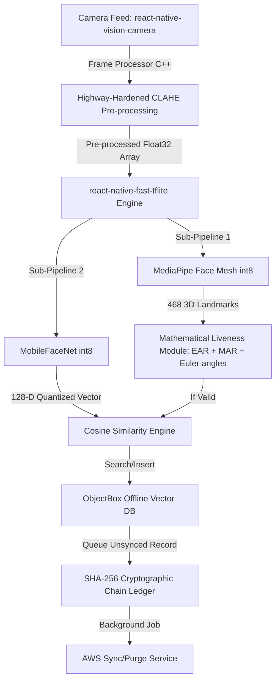

# NHAI Hackathon 7.0: Project Plan
## Offline Facial Recognition & Liveness Detection System (Zero-Network Zone)

**Role:** Principal Engineering Lead & Project Manager  
**Sprint Duration:** 24 Hours  
**Target Device Profile:** Mid-range Android/iOS (e.g., Snapdragon 680 / Helio G85, 4-6GB RAM)  
**Target Environment:** Zero-connectivity remote tollways, highway checkpoints, and national corridors.

---

## 1. Project Manifesto & Constraints

Operating in remote Indian transit corridors requires extreme architectural discipline. We are not building a cloud-reliant web wrapper; we are deploying a high-performance computer vision and cryptographic pipeline directly to edge silicon.

### Core Engineering Objectives
*   **100% Offline Autonomy:** Absolutely zero reliance on external network sockets during the primary identification loop.
*   **Latency Budget ($< 1.0\text{s}$):**
    *   Frame Pre-processing: $< 50\text{ms}$
    *   Landmark Detection (Liveness): $< 150\text{ms}$
    *   Face Embedding Generation: $< 300\text{ms}$
    *   Vector DB Index Lookup: $< 50\text{ms}$
    *   Total Budget: $\le 550\text{ms}$ average execution time, allowing a comfortable buffer below the 1.0s limit.
*   **Footprint Budget ($< 20\text{MB}$ total binary size):**
    *   Quantized MediaPipe Face Mesh model: $\approx 2.7\text{MB}$ (int8 quantized).
    *   Quantized MobileFaceNet embedding model: $\approx 5.2\text{MB}$ (int8 quantized).
    *   ObjectBox/WatermelonDB Native C-libraries: $\approx 3.5\text{MB}$.
    *   Application Bundle (JS engine, React Native runtime, assets): $\approx 8.0\text{MB}$.
    *   Total Native Footprint: $\approx 19.4\text{MB}$ (strict enforcement).

### Tech Stack Specification



*   **Runtime:** Bare React Native (v0.74+) using Hermes engine for optimized memory footprint and instant startup.
*   **Camera & Frame Processor:** `react-native-vision-camera` (v4.x) utilizing native Worklets for zero-copy C++ array access to video buffers.
*   **Inference Engine:** `react-native-fast-tflite` providing direct JNI/C++ bindings to the TensorFlow Lite GPU delegate or NNAPI (Android) / Metal (iOS).
*   **Liveness Model:** MediaPipe Face Mesh (quantized to 8-bit integer) to yield 468 3D landmark points.
*   **Recognition Model:** MobileFaceNet (int8 quantized), trained with ArcFace loss, outputting a highly discriminative 128-dimensional float32 vector representation of the face.
*   **Local Vector DB:** ObjectBox (React Native bindings) or WatermelonDB. ObjectBox is preferred due to native flatbuffer performance and local vector search acceleration.
*   **Sync Infrastructure:** AWS IoT Core / API Gateway (HTTPS POST endpoint) for atomic background batch sync and TTL-based local storage purging.

---

## 2. The 3 Core USPs (Our Winning Edge)

### USP 1: Cryptographic Queuing & Tamper-Proof Ledger
To prevent rogue operators from injecting synthetic records directly into the local database while offline, we treat the local transaction log as a hash-chained ledger (a micro-blockchain). 

Every local transaction $L_n$ generates a block defined as:
$$H_n = \text{SHA-256}(H_{n-1} \parallel T_n \parallel \text{User\_ID}_n \parallel \text{Lat}_n \parallel \text{Lon}_n \parallel \text{Confidence}_n)$$

*   Where $H_{n-1}$ is the cryptographic signature of the preceding log.
*   Where $T_n$ is the monotonic epoch timestamp.
*   $\text{Lat}_n, \text{Lon}_n$ are the GPS coordinates obtained via hardware fusion.
*   If a malicious user attempts to insert or modify a record retroactively, the hash chain breaks instantly, and the AWS Sync pipeline rejects the entire batch upon reconnection.

### USP 2: "Highway-Hardened" Frame Pre-Processing (CLAHE)
Indian toll checkpoints present extreme lighting anomalies: harsh direct overhead sunlight, deep canopy shadows, and high-beam headlamps. Standard global histogram equalization causes artifact blowing. 

We implement **Contrast Limited Adaptive Histogram Equalization (CLAHE)** at the native frame-processor level before feeding the tensor to the neural networks:
1.  Divide the frame into $8 \times 8$ non-overlapping contextual regions (tiles).
2.  Calculate the local histogram for each tile.
3.  Clip the histogram bins exceeding a designated threshold (e.g., limit set to $0.02 \times \text{total pixels in tile}$) to limit contrast amplification in flat areas (e.g., clear skies, solid asphalt).
4.  Redistribute the clipped pixels uniformly across all bins.
5.  Perform bilinear interpolation between neighboring tile mappings to eliminate artificial boundaries.

This ensures structural consistency and prevents neural network failures under extreme shadows or glare.

### USP 3: Premium Enterprise Polish & Academic Rigor
*   **UX Experience:** Fluid $60\text{fps}$ visual indicators powered by `react-native-reanimated` (v3). An active bounding box that shifts color dynamically from **Amber** (calculating liveness) to **Emerald** (face verified) or **Crimson** (liveness check failed).
*   **Academic Deliverable:** A formal, multi-page LaTeX technical documentation paper specifying our custom EAR/MAR algorithms, computational complexity analyses, and energy consumption profiling on mid-range ARM microarchitectures.

---

## 3. 24-Hour Sprint Timeline & Milestones

The timeline operates on a strict countdown system ($T\text{-minus}$).

```
[T-24]========================================================================[T-0]
  | T-24 to T-20 |  T-20 to T-14  |  T-14 to T-8   |  T-8 to T-4  | T-4 to T-2 | T-2 to T-0
  | Bootstrapping | Model Bridging | Liveness/CLAHE | Vector DB/Sec| Integration| LaTeX/Hardening
```

*   **T-24 to T-20 (Environment & Bridging):**
    *   Initialize React Native Bare app. Install and configure native modules (`vision-camera`, `fast-tflite`, `objectbox`).
    *   Set up physical device bridge profiles and compile empty C++ worklet frames.
*   **T-20 to T-14 (Model Bridging & Pipeline Integration):**
    *   Integrate `.tflite` model files in native assets.
    *   Validate `react-native-fast-tflite` loads MediaPipe Face Mesh and MobileFaceNet models onto hardware accelerators (NNAPI/GPU).
*   **T-14 to T-8 (Mathematical Liveness & Pre-processing Core):**
    *   Write the Eye Aspect Ratio (EAR), Mouth Aspect Ratio (MAR), and Head Pose Euler estimation math in pure JS/C++ Worklets.
    *   Implement and profile the CLAHE pre-processing filter within the camera framework.
*   **T-8 to T-4 (Local DB Vector Store & Tamper-Evident Ledger):**
    *   Build ObjectBox entity schemas with indexing for the 128-D vector embeddings.
    *   Implement the SHA-256 chain log serialization and local queue structure.
    *   Write the AWS Gateway HTTPS background sync task using `react-native-background-actions`.
*   **T-4 to T-2 (UI Polish, Micro-interactions & Integration Testing):**
    *   Connect the camera overlay to the state machine.
    *   Incorporate fluid motion indicators for face guidance (e.g., "Look Left", "Blink").
    *   Run stress test cases with simulated network drops.
*   **T-2 to T-0 (Production Hardening & System Benchmarks):**
    *   Measure CPU/GPU thermal throttling patterns on mid-range devices.
    *   Verify the final compiled `.apk` / `.ipa` is strictly under $20\text{MB}$.
    *   Compile the LaTeX technical report and generate the final pitch slides.

---

## 4. Module Delegation & Action Items

### 📁 Track 1: Core Mobile UI & Native Bridging (Frontend / Mobile Engineers)
*   [ ] **Project Environment & Shell Initialization:**
    *   Bootstrap React Native bare project with strict TypeScript linting and configuration.
    *   Configure system-level optimization flags in Proguard (`proguard-rules.pro`) to strip unused classes, reducing compiled output footprint.
*   [ ] **Camera Hardware Bridging:**
    *   Configure `react-native-vision-camera` (v4.x) with custom permissions, high-frame-rate settings ($30\text{fps}$ lock), and resolution constraints ($640 \times 480$ or $1280 \times 720$ max to prevent memory overflow).
    *   Build a custom Frame Processor Worklet using C++ native bindings to pipeline captured frames directly into the execution thread.
*   [ ] **Field-Ready UI/UX & High-Fidelity Animations:**
    *   Build a minimalist dark-themed operational dashboard optimized for outdoor viewability (no heavy third-party UI dependencies).
    *   Implement the active facial alignment grid using `react-native-reanimated` (v3) using spring physics for bounding-box updates to keep frames fluid.
    *   Provide real-time visual liveness prompts (e.g., "Blink slowly", "Smile slightly") with dynamic color indicators corresponding to system state (Amber for processing, Green for matched, Red for failure).

### 📁 Track 2: Edge AI Pipeline & Liveness Mathematics (AI / ML Engineers)
*   [ ] **Model Quantization & Inference Bridging:**
    *   Run post-training integer quantization (INT8) on the MediaPipe Face Mesh and MobileFaceNet ArcFace models using `tf.lite.TFLiteConverter`.
    *   Load quantized `.tflite` model files using `react-native-fast-tflite` and direct them to run on hardware acceleration delegates (NNAPI for Android, Metal GPU for iOS).
*   [ ] **Eye Aspect Ratio (EAR) Mathematical Module:**
    *   Extract specific landmark subsets corresponding to the eyes from the 468 landmarks array.
    *   Implement the mathematical EAR algorithm inside the high-performance frame worklet:
        $$\text{EAR} = \frac{||p_2 - p_6|| + ||p_3 - p_5||}{2 ||p_1 - p_4||}$$
    *   Code dynamic threshold calibration to calculate the open-eye baseline values within the first $500\text{ms}$ of scanning to normalize metrics.
*   [ ] **Mouth Aspect Ratio (MAR) Mathematical Module:**
    *   Implement the MAR mathematical equation inside the frame worklet to capture mouth movements (smile/open) and block printed photo spoofing attacks:
        $$\text{MAR} = \frac{||m_2 - m_8|| + ||m_3 - m_7|| + ||m_4 - m_6||}{2 ||m_1 - m_5||}$$
    *   Define upper/lower bounding thresholds to confirm deliberate mouth movement challenge completion.
*   [ ] **Euler Angle Pose Calculations:**
    *   Select 3D facial coordinate anchors (nose tip, chin, eye corners, mouth corners) and implement a lightweight perspective projection algorithm to extract Pitch, Yaw, and Roll.
    *   Configure challenge-response scripts (e.g., "Rotate head left by $15^{\circ}$") to verify depth and movement.
*   [ ] **Cosine Similarity Face Matcher:**
    *   Extract the cropped face image, forward it to MobileFaceNet, and fetch the L2-normalized 128-D vector.
    *   Implement the mathematical Cosine Similarity module:
        $$\text{Similarity} = \frac{\mathbf{A} \cdot \mathbf{B}}{\|\mathbf{A}\| \|\mathbf{B}\|}$$
    *   Because embeddings are L2-normalized, optimize the similarity check down to a pure dot product:
        $$\text{Similarity} = \sum_{i=1}^{128} A_i \cdot B_i$$
    *   Set the verification threshold (e.g., $\text{Similarity} \ge 0.72$ for match confirmation).

### 📁 Track 3: Local Data Layer, Security & Cloud Sync (DevOps / Backend Engineers)
*   [ ] **ObjectBox/WatermelonDB Vector Storage:**
    *   Initialize the local database engine and define schemas: `User` (ID, Name, Metadata, 128-D Float Array embedding representation) and `AuditLog` (ID, Timestamp, GPS, Verification Status, Confidence, Signature).
    *   Configure local vector indexing parameters inside ObjectBox using Cosine distance indices to support ultra-low-latency query searches against local registers of up to 10,000 enrolled targets.
*   [ ] **SHA-256 Cryptographic Chaining Ledger:**
    *   Implement the hash-chain function in native memory. Convert transaction attributes to a rigid, deterministic JSON string:
        `payload = timestamp + user_id + latitude + longitude + status`
    *   Compute the SHA-256 hash using the previous block's hash as a salt:
        $$H_n = \text{SHA-256}(H_{n-1} \parallel T_n \parallel \text{User\_ID}_n \parallel \text{Lat}_n \parallel \text{Lon}_n \parallel \text{Status}_n)$$
    *   Commit the transaction state alongside the unique computed hash.
*   [ ] **Background Sync & AWS Purging Service:**
    *   Configure `react-native-background-actions` / `WorkManager` (Android) / `BGAppRefreshTask` (iOS) to trigger when the device regains connectivity.
    *   Build a secure payload serializer to send blocks in chronological order via HTTPS to AWS API Gateway, routing to DynamoDB/Lambda.
    *   Build a local cleanup service executing a 48-hour TTL purge on synced records to conserve storage space.

### 📁 Track 4: Image Pre-processing, QA & Documentation (Systems / Technical Writers)
*   [ ] **Native Image Pre-processing (CLAHE):**
    *   Implement Contrast Limited Adaptive Histogram Equalization (CLAHE) as a high-performance C++ helper.
    *   Optimize pixel operations using ARM NEON assembly operations or native direct-memory pointers to keep latency under $30\text{ms}$ per frame.
*   [ ] **Hardware Benchmark QA:**
    *   Conduct profiling tests on mid-range test devices (e.g., Snapdragon 680).
    *   Measure CPU/GPU thermal behaviors, battery drain percentages, and memory footprint metrics during continuous 10-minute facial tracking loops.
    *   Audit garbage collection frequency in the Javascript runtime to ensure frame rendering remains stable at $60\text{fps}$.
*   [ ] **LaTeX Whitepaper & Presentation Materials:**
    *   Draft a high-grade academic-standard technical document detailing our mathematical formulations (EAR, MAR, Cosine Similarity), performance latencies, and security safeguards in LaTeX.
    *   Compile the pitch deck highlighting design layouts, system benchmark graphs, and operational resilience details in high-contrast formats.

---

## 5. Strict Git Workflow

During a high-speed 24-hour sprint, code collisions can easily cost hours of engineering time. We enforce a zero-compromise version control protocol.

### 1. Branch Naming Standard
Every branch must be prefixed with the functional category:
*   `feat/<track-number>-<feature-name>` (e.g., `feat/t2-liveness-ear-math`, `feat/t3-objectbox-schema`)
*   `fix/<track-number>-<bug-desc>` (e.g., `fix/t1-camera-ios-crash`, `fix/t4-clahe-neon-overflow`)
*   `perf/<track-number>-<perf-desc>` (e.g., `perf/t2-cosine-dot-product`)
*   `docs/<track-number>-<doc-desc>` (e.g., `docs/t4-latex-architecture`)

### 2. Pull Request (PR) & Review Rules
*   **Target:** All development branches branch off and target `develop`. The `main` branch is locked and reserved purely for working production tags.
*   **PR Size Limit:** Keep changes localized. Max 400 lines of code changed per PR to guarantee swift reviews.
*   **Review Quorum:** A minimum of **1 peer review approval** is required before merge.
*   **Pre-Commit Hook Integration:** Ensure your code is formatted correctly using Prettier and passes ESLint rules before submitting a pull request.
*   **Review Guidelines:**
    *   Verify that any new JS allocations within the Frame Processor are zeroed out or recycled to prevent garbage collection spikes.
    *   Ensure all new cryptographic calculations are executed off the main UI thread.

### 3. Merge Strategy
*   Enforce **Squash and Merge** on all PRs targeting `develop` to maintain a clean, linear history.
*   No developer is allowed to push directly to `develop` or `main`. All direct commits will be rejected by repository settings.

---

## 6. Mathematical Formulas for Direct Implementation

Use these equations exactly in the codebase to implement our USP mathematical engines:

### Liveness Metric: Normalized EAR
$$\text{EAR} = \frac{\sqrt{(x_{p2} - x_{p6})^2 + (y_{p2} - y_{p6})^2} + \sqrt{(x_{p3} - x_{p5})^2 + (y_{p3} - y_{p5})^2}}{2 \sqrt{(x_{p1} - x_{p4})^2 + (y_{p1} - y_{p4})^2}}$$

### Liveness Metric: Normalized MAR
$$\text{MAR} = \frac{\sqrt{(x_{m2} - x_{m8})^2 + (y_{m2} - y_{m8})^2} + \sqrt{(x_{m3} - x_{m7})^2 + (y_{m3} - y_{m7})^2} + \sqrt{(x_{m4} - x_{m6})^2 + (y_{m4} - y_{m6})^2}}{2 \sqrt{(x_{m1} - x_{m5})^2 + (y_{m1} - y_{m5})^2}}$$

### Face Similarity: L2-Normalized Dot Product
Given output embeddings $\mathbf{u}, \mathbf{v} \in \mathbb{R}^{128}$ from MobileFaceNet:

1.  **L2-Normalization Step:**
    $$\hat{\mathbf{u}} = \frac{\mathbf{u}}{\|\mathbf{u}\|_2} = \frac{\mathbf{u}}{\sqrt{\sum_{i=1}^{128} u_i^2}}$$
2.  **Dot Product Similarity (Fast Inference):**
    $$\text{Sim}(\hat{\mathbf{u}}, \hat{\mathbf{v}}) = \sum_{i=1}^{128} \hat{u}_i \cdot \hat{v}_i$$

---

### Sprint Launch Checklist
- [ ] Initialize git repository and create `main` and `develop` branches.
- [ ] Push this `plan.md` to the root of the project repository.
- [ ] Track 1: Complete bare react-native app skeleton.
- [ ] Track 2: Obtain the official MediaPipe and MobileFaceNet int8 models and verify conversion pipelines.
- [ ] Track 3: Set up local SQLite / ObjectBox config files and verify compiler support.
- [ ] Track 4: Establish the LaTeX project workspace and outline the presentation deck layout.

**Let's get to work. Execution starts now.**
